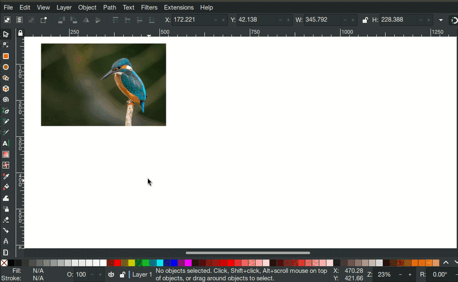

# Raster Perspective

Apply a perspective transformation to bitmap image using the selected path as envelope, without the need to use an external software to transform the image.

# Installation:

## On Linux:

```
cd $HOME/.config/inkscape/extensions
git clone https://github.com/s1291/InkRasterPerspective.git
```

* Open Inkscape (if it is already open, close then re-open it) and you should find the extension under: **Extensions** > **Raster Perspective** > **Perspective**

## On Windows:

* Download the most recent version (direct link: [zip](https://github.com/s1291/InkRasterPerspective/archive/refs/heads/master.zip))
* Extract it and copy the files `imagePerspective.py` and `imagePerspective.inx` to `C:\Program Files\Inkscape\share\inkscape\extensions`


# How to use

> (This extension was tested with both Inkscape 1.1.1 and 1.2-dev on GNU/Linux Ubuntu 20.04.3)

1. Select the raster image and the quadrangle path (envelope) . Make sure the envelope nodes are ordered as follows:


For more details on how to find the nodes order for a path, check out this [post](https://graphicdesign.stackexchange.com/a/155289/147300).

2. Extensions > Raster Perspective > Perspective

See below:



# Author
Samir OUCHENE, 2021-2022

All code is licensed under the GNU General Public License version 3. See [the license file](https://github.com/s1291/InkRasterPerspective/blob/master/LICENSE) for details.
